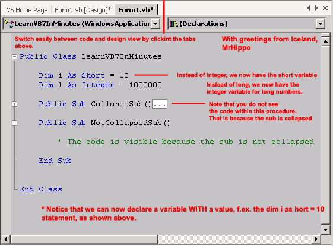

<div align="center">

## Get ready for VB\.Net \- The good stuff \#1


</div>

### Description

Microsoft Visual Studio.net (v.7.0) Including the awesome new Visual Basic.net language is now available. VB is now 100% object oriented, threads are now available, no more runtime libraries etc. Check out this small article with a screenshot to learn the basics of the new stuff in VB.NET ...
 
### More Info
 


<span>             |<span>
---                |---
**Submitted On**   |
**By**             |[N/A](https://github.com/Planet-Source-Code/PSCIndex/blob/master/ByAuthor/empty.md)
**Level**          |Intermediate
**User Rating**    |4.6 (32 globes from 7 users)
**Compatibility**  |VB 6\.0, ASP \(Active Server Pages\) 
**Category**       |[Miscellaneous](https://github.com/Planet-Source-Code/PSCIndex/blob/master/ByCategory/miscellaneous__1-1.md)
**World**          |[Visual Basic](https://github.com/Planet-Source-Code/PSCIndex/blob/master/ByWorld/visual-basic.md)
**Archive File**   |[](https://github.com/Planet-Source-Code/get-ready-for-vb-net-the-good-stuff-1__1-13072/archive/master.zip)


### Source Code

```
The new Visual Studio.net (v.7.0) comes with a brand new user interface.
As shown above, you now switch between your code and design view, by clicking the appropriate tab. You can switch between open forms (now called Windows Forms) by selected the appropriate tab.
Variables have changed, f.ex. the good old integer variable is now called short. The long variable is now called integer!!! You can not use variables without defining them first (Developers who used the option explicit statement are familiar with this). A new powerful feature is presented in VB.NET, you can now declare a variable with a value in it. This is similar to the old C++ from Visual Studio 6.0.
Statements like on error goto are now history. Instead we have the Try statement which is very similar to the one we have in Delphi.
Another great feature in .Net is the collapse option in the code view. When writing complex application you may get lost in spagetti code. Now you can collapse classes, functions, procedures, scopes etc. This enables you to keep a better track of your code. An example of this is shown above.
Typecasting is now available in .Net. We can no longer pass integer values to strings without typecasting. At first this sounds boring and dreadful but this prevents mistakes so this is really a great new feature.
.net provides us with better access to memory.
Overall VB.Net is going to make us, the VB programmers, the most valuable programmers on the market and will enable us to write killer applications in no-time.
With greetings from Iceland,
MrHippo,
```

